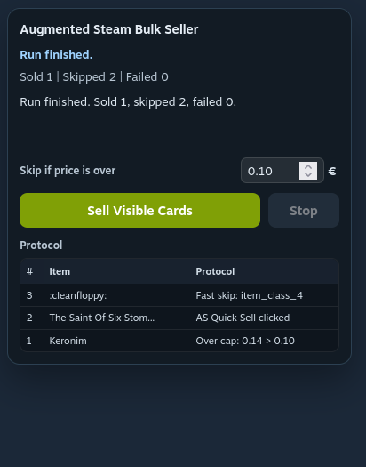

# Bulk Seller for Augmented Steam

Small userscript for Steam inventories and the Steam market page that batch-clicks Augmented Steam sell buttons or removes your active market listings.

## Installation

Install directly in Violentmonkey from the repository using the raw userscript URL:

- [Install bulk-card-seller-for-augmented-steam.user.js](https://raw.githubusercontent.com/Dobbelklick/BulkCardSellerForAugmentedSteam/main/bulk-card-seller-for-augmented-steam.user.js)

The userscript header includes repository-backed `@downloadURL` and `@updateURL` entries, so Violentmonkey can check this repo for updates after installation.

The widget shows the current run state, counters, page-specific controls, and a protocol log for the current Steam page.

## What It Does

On Steam inventory pages, it processes up to 25 visible inventory items and, for each eligible trading card, triggers Augmented Steam's:

- `Quick Sell` or, if the button is not available, `Instant Sell`

On https://steamcommunity.com/market/ it adds a `Remove Active Listings` button that batch-clicks the native `Remove` buttons for your active sell listings.

It also shows a small control widget with:

- start, remove, and stop controls depending on the page
- a max price cap for inventory selling
- progress status
- a protocol log of processed, skipped, and failed entries

## Requirements

This script does not work on its own.

It requires all of the following:

1. A userscript manager such as Violentmonkey or Tampermonkey.
2. The browser extension `Augmented Steam` installed and active.
3. Either a Steam inventory page with visible marketable items or the Steam market home page with active listings.

## Important Limitations

### Augmented Steam Is Required

This script depends on sell controls injected by Augmented Steam into the Steam inventory UI.

Without Augmented Steam, the script has no sell buttons to click and will not function.

### Single Visible Inventory Page Only

This script only works on the currently visible inventory page in Steam's inventory pager.

That means:

- it does not automatically move to the next inventory page
- it does not process your full inventory in one run
- it only processes the items currently rendered on the active page

This way the script handles at most 25 visible items per run.

### Market Removal Uses Native Steam Actions

On the market home page, the script uses Steam's own `Remove` controls from your active listings section.

It removes entries one by one and can continue across the paginated active listings view.

### Trading Cards Only

The script is intended for Steam trading cards and skips non-card items when the item metadata clearly identifies them as something else.
It won't sell guns skins, avatars, or whatever else may appear in a Steam inventory.

### No Native Steam Selling Logic

This script does not implement its own selling workflow against Steam directly.
It only automates the Augmented Steam controls already present in the inventory panel.
It's an extension for an extension.

## How To Use

1. Install `Augmented Steam`.
2. Install this userscript in your userscript manager.
3. Open one of these pages:
	- your Steam inventory page: https://steamcommunity.com/id/USERNAME/inventory
	- the market home page: https://steamcommunity.com/market/
4. For inventory selling, make sure the inventory page you want to process is the currently visible one.
5. For inventory selling, wait for the Augmented Steam sell controls to appear when selecting marketable cards.
6. Use the widget in the top-right corner:
	- click `Sell Visible Cards` on inventory pages
	- click `Remove Active Listings` on the market page

## Safety Notes

- Review the max price threshold before starting a run.
- Watch the protocol log for skipped or failed items.
- Test on a small page first before using it repeatedly.
- You can stop the script at any moment with its 'Stop' button or by simply closing the page.
- It will not start by itself.
- On the market page, double-check that you really want to remove all currently active sell listings before starting.
- Steam inventory and market UI behavior can change over time, which may break the script.

## Matching Pages

The script runs on:

- `https://steamcommunity.com/id/*/inventory*`
- `https://steamcommunity.com/profiles/*/inventory*`
- `https://steamcommunity.com/market/`

## File

The main userscript is:

- [bulk-card-seller-for-augmented-steam.user.js](./bulk-card-seller-for-augmented-steam.user.js)